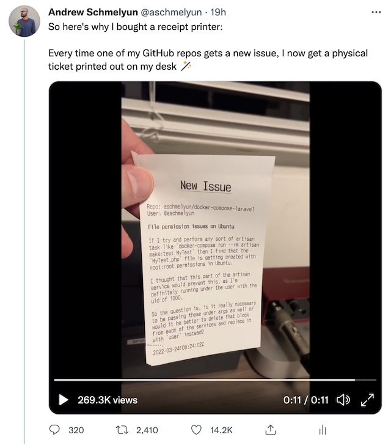

# GitHub Receipts

This is the source code that powers my GitHub issues receipt printer. If you'd like to learn more about what inspired this and how I put everything together, check out the full article and tutorial on it [here](https://aschmelyun.com/blog/i-built-a-receipt-printer-for-github-issues).

